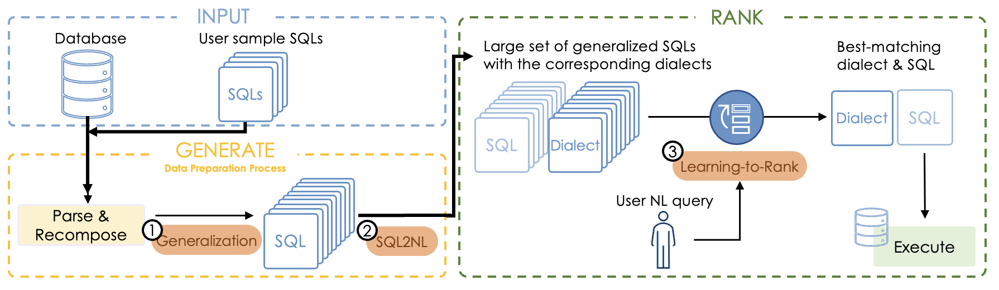

# G<span style="font-size:0.8em;">A</span><span style="font-size:0.8em;">R</span>: A Generate-and-Rank Approach for Natural Language to SQL Translation
> NL2SQL by generating candidate SQLs and ranking for them.
> 
The official repository which contains the code and pre-trained models for our paper [GAR: A Generate-and-Rank Approach for Natural Language to SQL Translation](https://arxiv.org/). *2023 IEEE 39th International Conference on Data Engineering (ICDE).*

<p align="center">
   <a href="https://github.com/ElementAI/picard/blob/main/LICENSE">
        
   </a>
   <a href="https://github.com/MLNLP-World/Paper_Writing_Tips/stargazers">
       
  	</a>
  	<a href="https://github.com/MLNLP-World/Paper_Writing_Tips/network/members">
       
  	</a>
    <a href="https://github.com/MLNLP-World/Paper_Writing_Tips/issues">
      
    </a>
    <br />
</p>

If you use GAR in your work, please cite it as follows:

```bibtex
@inproceedings{Yuankai2023:GAR,
  author = {Yuankai Fan,Zhenying He,Tonghui Ren,Dianjun Guo,Lin Chen,Ruisi Zhu,Guanduo Chen,Yinan Jing,Kai Zhang,X.Sean Wang},
  title = "{GAR}: A Generate-and-Rank Approach for Natural Language to SQL Translation",
  booktitle = "2023 IEEE 39th International Conference on Data Engineering",
  month = april,
  year = "2023",
  publisher = "",
  url = "",
}
```

## Watch The Video

[](https://youtu.be/KLPuQmgHxUY)

## Overview

This code implements:

* The GAR method for generate-and-ranking queries.
* A NL2SQL model under few-shot learning setting, which can achieve significant improvement over several benchmarks. 

### About GAR
> **TL;DR:** We introduce GAR -- a novel generate-and-rank approach to tackle NL2SQL translation problem.
> GAR assumes a set of sample queries on a database is given, and can use SQL queries that are "component-similar" to the given samples to answer NL queries.

The objective of NL2SQL translation is to convert a natural language query into a SQL query. 

Although *seq2seq-based approaches* have shown good results on standard benchmarks, they may not perform well on more complex queries that demand an understanding of the database's specific structure and semantics. The main issue is that such complex queries require more training data on the target database, which is not generally provided in the benchmarks.

A more effective strategy would be to move away from the conventional seq2seq framework and aim to address the shortage of training data for the NL2SQL task.
This is the approach taken by the GAR method.

### How it works

Given a set of sample SQL queries, GAR uses the following three steps to do the translation:

1. **Generalization**: Use a set of generalization rules to generalize the sample queries to provide a good coverage for component-similar queries.
2. **SQL2NL**: Translate the sample and generalized SQL queries to NL expressions called dialects.
3. **Learning-to-rank**: Rank the dialect expressions based on the semantic similarity with a given NL query and find the closest one and hence the SQL query as the translation result.

This process is illustrated in the diagram below:

<div style="text-align: center">

</div>


## Quick Start

### Prerequisites
First, you should set up a python environment. This code base has been tested under python 3.7.

1. Install the required packages
```bash
pip install -r requirements.txt --no-deps
```
2. Download the [Spider](https://yale-lily.github.io/spider) and [GEO](https://github.com/sriniiyer/nl2sql/tree/master/data/geo) datasets, and put the data into the <strong>datasets</strong> folder (QBEN data is published here.). Unpack the datasets and create the following directory structure:
```
/datasets
├── spider
│   ├── database
│   │   └── ...
│   ├── dev.json
│   ├── dev_gold.sql
│   ├── tables.json
│   ├── train_gold.sql
│   ├── train_others.json
│   └── train_spider.json
└── geo
    ├── database
    │   └── ...
    ├── dev.json
    ├── test.json
    ├── train.json
    ├── tables.json
```

### Training
The training script is located in the root directory `train_pipeline.sh`.
You can run it with:
```
$ bash train_pipeline.sh <dataset_name> <train_data_path> <dev_data_path> <table_path> <db_dir>
```

The training script will create the directory `saved_models` in the current directory. Training artifacts like checkpoints will be stored in this directory.

The training includes four phasees:
1. Retrieval model training data generation. <em>Please note that this phase expects to take some time to generate a large set of SQL-dialect pairs for each training databases.</em>
2. Retrieval model training
3. Re-ranking model training data generation
4. Re-ranking model training

The default configuration is stored in `configs/cofig.py`. You can use this configuration to reproduce our results.

#### Download the checkpoints

We have uploaded ranking model checkpoints on different datasets below. Meanwhile, since the generalization process is time-consuming, we also provide the generalized SQL queries for reproducing our experimental results.

Model |  Dataset | Download Queries | Download Model
----|---|----|----
`gar.geo`  | GEO | [gar.geo.zip](https://drive.google.com/file/d/1Y_E7DYiNwp6zvEefWrlozuZ9uBpjsRgy/view?usp=share_link) | [gar.geo.tar.gz](https://drive.google.com/file/d/13oOEkAHwF7i0iiWgVBdcMBR8lijEuF4o/view?usp=share_link)
`gar-j.geo`  | GEO | [gar-j.geo.zip](https://drive.google.com/file/d/1HK_lkV0ghNaP8IjYYq6-cWjxOikZfjdn/view?usp=share_link) | [gar-j.geo.tar.gz](https://drive.google.com/file/d/1wD5lJwEYRNLoM-HdgW3PWjT8dTS1wLsg/view?usp=share_link)
`gar.spider`   | Spider | [gar.spider.zip](https://drive.google.com/file/d/1Rn-87hvP5shWNFofpm4FWj_XmOekDT4w/view?usp=share_link) | [gar.spider.tar.gz](https://drive.google.com/file/d/16Y6iFwi15AoHfIUCXcIa4af4fRtsbWFg/view?usp=share_link)
`gar-j.spider` | Spider | [gar-j.spider.zip](https://drive.google.com/file/d/1jkHrg1LpzIZf9tFXCTj6KX-BEl52zGHW/view?usp=share_link) | [gar-j.spider.tar.gz](https://drive.google.com/file/d/1AKH2IfaANcwUfbEv2zSpR1M0SZzuS3Yw/view?usp=share_link)

Unpack the model checkpoints and the corresponding generalized queries with the following directory structure:
```
/saved_models
├── gar.spider
│     └── ...
├── gar-j.spider
│     └── ...
├── gar.geo
│     └── ...
├── gar-j.geo
│     └── ...
/serialization
├── gar.spider
├── gar-j.spider
├── gar.geo
├── gar-j.geo

```

### Evaluation
The evaluation script is located in root directory `test_pipeline.sh`.
You can run it with:
```
$ bash test_pipeline.sh <dataset_name>  <test_file_path> <test_gold_sql_file> <table_path> <db_dir>
```

The evaluation script will create the directory `output` in the current directory.
The evaluation results will be stored there.

## Contributing
This project welcomes contributions and suggestions 👍.
